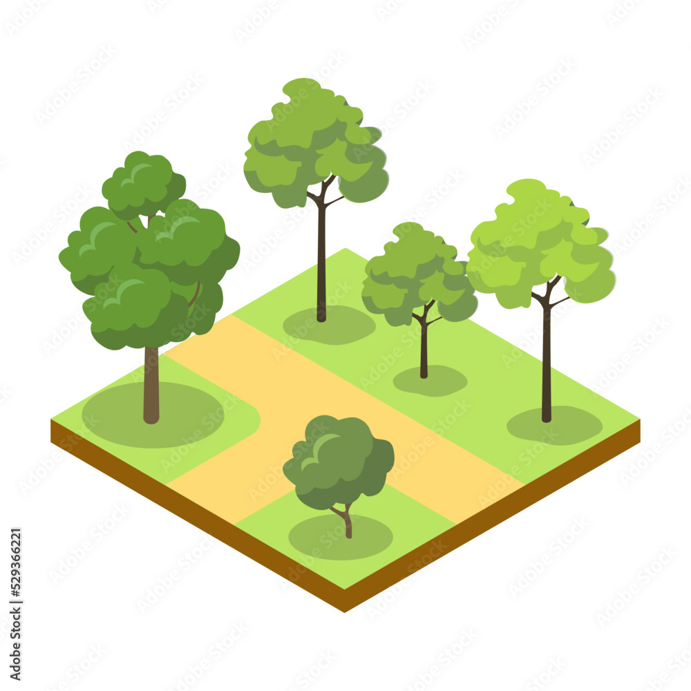
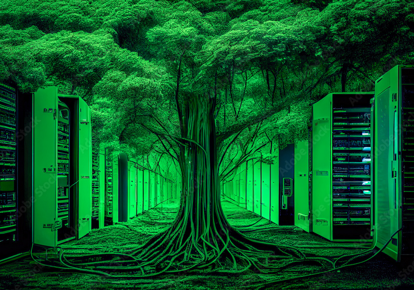

# GeoTreesGuardians
GeoTrees Guardians es un proyecto comunitario que une a familias, amigos y vecinos en una misión trascendental: proteger y preservar nuestro entorno natural. A través de tecnologías como mapas geográficos, machine learning y la IA podemos brindar un entorno donde fluya la colaboración colectiva. 

¿Qué Hacemos?

Estamos georreferenciando cada árbol de nuestra comunidad con sus características, calculando por procesos de IA el volumen de carbono que almacenan y utilizando infrarrojo cercano para monitorear la salud de sus follajes.

En GeoTrees Guardians, cada uno cuenta y se convierte en un guardián del futuro, una conexión viva con la Tierra que todos compartimos. Con cada dato recolectado, estamos construyendo un legado verde para las generaciones futuras, uniendo eco-tecnología y comunidad en una red vibrante de vida y esperanza. Juntos, estamos transformando nuestro entorno en un baluarte de sostenibilidad, donde cada árbol cuenta una historia de resiliencia y cuidado compartido.

Únete a nosotros en esta épica misión de preservación y descubrimiento. Cada árbol que tocamos, cada dato que recolectamos, es un paso hacia un mundo más verde, más sano, y más unido. ¡Seamos los guardianes de nuestros GeoTrees, protectores del presente y arquitectos del futuro!

